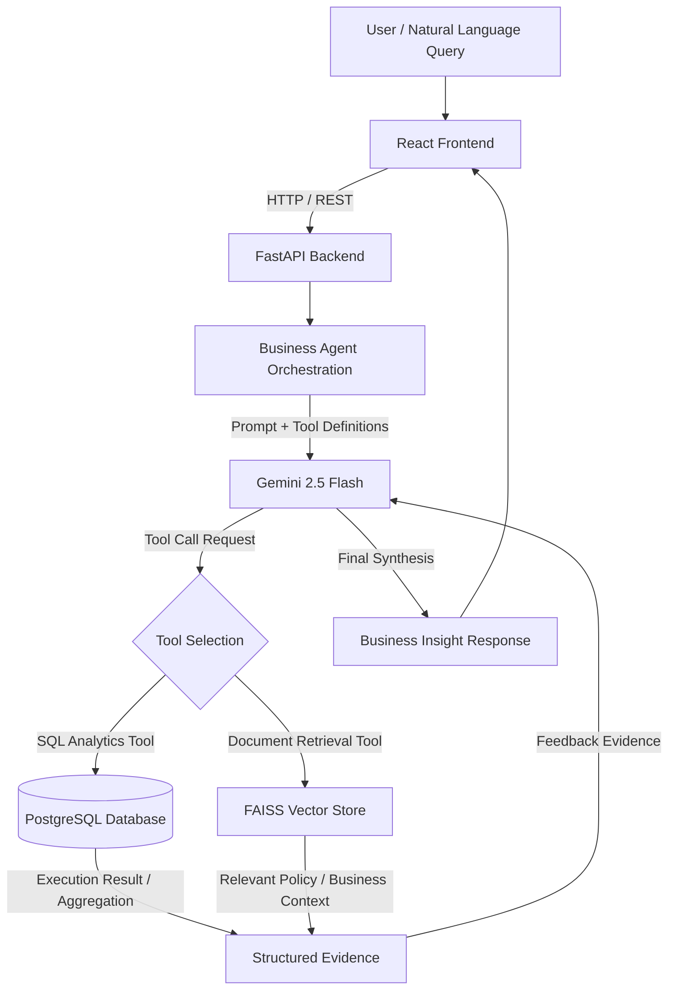

# DecisionIQ — Agentic Business Decision Intelligence System

An LLM-powered business intelligence and decision support system that enables users to query complex transactional data and internal business context using natural language.

DecisionIQ orchestrates an LLM-driven agent (powered by Gemini 2.5 Flash), structured SQL analytics tools over PostgreSQL, and vector similarity search over internal business documents via FAISS.

---

## Technical Architecture & Flow

DecisionIQ separates natural language interpretation, data retrieval, context grounding, and insight synthesis into distinct system layers.



### Architectural Principles

- **Decoupled Data Execution:** The LLM never directly executes raw SQL queries against the database. Instead, it interfaces with application-level tools with defined schema expectations and boundary validations.
- **Separation of Evidence and Interpretation:** Numerical findings are computed deterministically via PostgreSQL. Policy context is retrieved via semantic search. The LLM's sole role is orchestration, parameter selection, and qualitative synthesis based strictly on returned tool evidence.
- **Evidence-Based Reasoning:** System instructions prohibit the LLM from inventing figures or assuming causal relationships without explicit data support.

---

## Agent Orchestration (LangGraph Flow)

The business agent is orchestrated using a state graph pattern (LangGraph style) in `app/agents/business_agent.py`:

```
+-----------------------------------------------------------------------------------+
|                                 Business Agent                                    |
|                                                                                   |
|   1. Receive User Question + System Instructions                                  |
|   2. Format Conversation Messages (System, User, Tool Messages)                   |
|   3. Call Gemini 2.5 Flash (`google-genai` SDK) with registered Tool Specs        |
|   4. Inspect Response:                                                            |
|        a. If Model requests Function Call(s) -> Execute Local Python Tool         |
|        b. Append Tool Response to Messages -> Loop back to Gemini 2.5 Flash       |
|        c. If Model returns Final Text -> Finalize Evidence & Return Result        |
|   5. Enforce Max Iterations Guardrail (Default: 6 steps)                          |
+-----------------------------------------------------------------------------------+
```

### Step-by-Step Execution Loop

1. **Input Ingestion:** The agent initializes a message stack with a system prompt setting bounds on evidence, domain assumptions, and business reasoning rules.
2. **Model Call:** The agent invokes Gemini 2.5 Flash passing available tool specifications.
3. **Tool Invocation:** If Gemini requests tool calls (e.g., calling `get_profit_trend` or `search_business_documents`), the orchestration layer executes the function locally against PostgreSQL or FAISS.
4. **Tool Result Injection:** The tool's output is wrapped into a tool response payload and appended back to the conversation thread.
5. **Synthesis or Recursion:** Gemini evaluates the updated thread. If sufficient evidence is collected, it generates the final answer. If more data is needed, it issues additional tool calls until the iteration limit is reached.

---

## Business Tools

All deterministic analytics and RAG integrations are exposed to the agent as explicit python tools (`app/tools/business_tools.py` and `app/rag/rag_tool.py`).

| Tool Name | Purpose | Data Source |
|---|---|---|
| `get_business_summary` | Provides overall KPI summaries (Sales, Profit, Orders, Quantity, Avg Discount) over a specific date range or category. | PostgreSQL (orders) |
| `get_profit_trend` | Computes profit and sales aggregated over time (monthly, quarterly, yearly). | PostgreSQL (orders) |
| `get_monthly_trend` | Generates detailed monthly sales, profit, order count, and discount trends for a specific year. | PostgreSQL (orders) |
| `compare_periods` | Executes comparative period analysis (e.g., Month-over-Month or Year-over-Year percentage changes) across metrics. | PostgreSQL (orders) |
| `get_operational_changes` | Analyzes changes in shipping modes, product sub-categories, and discount behaviors between two periods. | PostgreSQL (orders) |
| `search_business_documents` | Semantic search over internal business policies, KPI definitions, and governance documents. | FAISS Vector Store (data/documents/) |

---

## PostgreSQL Analytics & Dataset Architecture

Deterministic numerical analyses rely on a PostgreSQL relational database populated with the Global Superstore transaction dataset.

### Dataset Profile

- **Transactions:** 51,290 rows
- **Orders:** 25,035 unique orders
- **Customers:** 4,873 unique customers
- **Products:** 10,292 unique items
- **Date Range:** 2011 to 2014

### Database Schema (`orders`)

| Field Name | Postgres Type | Description |
|---|---|---|
| row_id | INTEGER PRIMARY KEY | Transaction unique identifier |
| order_id | VARCHAR(50) | Global Superstore order ID |
| order_date | DATE | Date order was placed |
| ship_date | DATE | Date order was shipped |
| ship_mode | VARCHAR(50) | Fulfillment speed class |
| customer_id | VARCHAR(50) | Customer unique identifier |
| customer_name | VARCHAR(100) | Full customer name |
| segment | VARCHAR(50) | Customer segment (Consumer, Corporate, Home Office) |
| city | VARCHAR(100) | Destination city |
| state | VARCHAR(100) | Destination state |
| country | VARCHAR(100) | Destination country |
| postal_code | VARCHAR(20) | Destination postal code |
| market | VARCHAR(50) | Regional market grouping |
| region | VARCHAR(50) | Geographic sales region |
| product_id | VARCHAR(50) | Product SKU identifier |
| category | VARCHAR(50) | Top-level product category |
| sub_category | VARCHAR(50) | Product sub-category |
| product_name | TEXT | Full product title |
| sales | NUMERIC(12, 4) | Transaction gross revenue |
| quantity | INTEGER | Units purchased |
| discount | NUMERIC(5, 4) | Percentage discount applied |
| profit | NUMERIC(12, 4) | Transaction net profit |
| shipping_cost | NUMERIC(12, 4) | Freight charge incurred |
| order_priority | VARCHAR(20) | Logistics urgency rating |

### Cleaning & Ingestion Pipeline (`scripts/clean_superstore.py`)

```
Raw CSV Dataset (data/raw/Global Superstore.csv)
       │
       ▼
Clean Field Names (lowercase, sanitize spaces/special characters)
       │
       ▼
Parse Dates (order_date, ship_date -> YYYY-MM-DD)
       │
       ▼
Cast Numeric Types (sales, profit, shipping_cost, discount, quantity)
       │
       ▼
Handle Missing Values (postal_code defaults, empty strings cleaned)
       │
       ▼
Save Processed CSV (data/processed/cleaned_superstore.csv)
       │
       ▼
Load to Postgres via SQLAlchemy (scripts/load_to_postgres.py)
```

---

## Business Knowledge RAG System

While transactional data answers "What happened?", internal documentation provides context on "Why did it happen?" or "What policy applies?".

### RAG Pipeline Architecture

```
Markdown Documents (data/documents/*.md)
       │
       ▼
Document Loader (app/rag/document_loader.py)
       │
       ▼
Recursive Character Chunker (app/rag/document_chunker.py)
 [Chunk Size: 500, Overlap: 100]
       │
       ▼
SentenceTransformers Embeddings (app/rag/embeddings.py)
 [Model: all-MiniLM-L6-v2, 384-Dimensions]
       │
       ▼
FAISS Index Generation (app/rag/vector_store.py)
 [data/faiss_index/index.faiss]
       │
       ▼
Semantic Search Retrieval (app/rag/rag_tool.py)
 [Top-k Similarity Search]
```

### Knowledge Base Composition

The `data/documents/` directory contains 10 domain-specific Markdown documents (generating ~179 vector chunks):

- `company_business_overview.md`: Global Superstore operating model and regional structure.
- `business_data_dictionary.md`: Column definitions and schema mapping.
- `business_kpi_definitions.md`: Mathematical definitions for profit margin, discount rates, and shipping ratios.
- `pricing_discount_policy.md`: Rules governing discount authorizations and margin thresholds.
- `shipping_fulfillment_policy.md`: Service-level agreements (SLAs) for Shipping Modes and freight cost rules.
- `customer_segmentation_strategy.md`: Classification rules for Consumer, Corporate, and Home Office accounts.
- `product_category_management.md`: Margin goals for Technology, Furniture, and Office Supplies.
- `root_cause_analysis_playbook.md`: Investigative frameworks for analyzing margin drops or sales spikes.
- `business_scenario_playbook.md`: Standard diagnostic workflows for common executive queries.
- `business_analysis_governance.md`: Rules prohibiting assumptions of causality without corroborating transaction and policy data.

> **Note:** These documents represent synthetic/demo business context tailored for the system's retrieval evaluation.

---

## Core Reliability & Evidence Principle

DecisionIQ strictly enforces an Evidence-Based Reasoning Framework in system prompts:

- **Transaction Evidence vs. Business Context vs. Model Inference:**
  - SQL Analytics provides numerical transaction facts.
  - RAG Retrieval provides corporate policy and KPI definitions.
  - LLM Output must distinctly separate observed facts from theoretical interpretations.
- **Correlation ≠ Causation:**
  - If sales drop while discounts increase, the system reports the mathematical concurrence.
  - The agent is instructed never to assume management intent or unverified market conditions as definitive causes without explicit document or tool evidence. If a cause cannot be established from the evidence, the agent explicitly states this limitation.

---

## FastAPI Backend Specification

The backend (`app/main.py`) exposes a REST API for serving agent investigations and data exploration.

### API Endpoints

#### `GET /`

**Purpose:** Health check endpoint.

**Response:**
```json
{
  "status": "healthy",
  "app": "DecisionIQ API",
  "version": "1.0.0"
}
```

#### `POST /api/ask`

**Purpose:** Submit a natural language business question to the agent.

**Request Body:**
```json
{
  "question": "Why did profit decline in July 2014 compared to June 2014?"
}
```

**Response Body:**
```json
{
  "question": "Why did profit decline in July 2014 compared to June 2014?",
  "answer": "...",
  "evidence": [
    {
      "tool_name": "compare_periods",
      "arguments": { "period1_start": "2014-06-01", "period1_end": "2014-06-30", "period2_start": "2014-07-01", "period2_end": "2014-07-31" },
      "result": { ... }
    }
  ],
  "steps_taken": 3
}
```

---

## React Frontend Framework

The user interface (`decisioniq-frontend/`) is structured as an Agentic BI Command Center using React, Vite, Tailwind CSS, and Lucide Icons.

### UI Pages & Modules

- **Overview:** High-level platform architecture and operational metrics.
- **Dataset Explorer:** Interface for inspecting the Global Superstore dataset attributes and transaction metrics.
- **Investigation Desk:** Interactive prompt interface where users issue queries, observe real-time agent tool selection, review structured evidence cards, and read synthesized insights.
- **Business Knowledge:** Document library displaying ingested Markdown governance files and vector chunk statistics.
- **System Architecture:** Live technical visualizer mapping FastAPI, Gemini 2.5 Flash, PostgreSQL, and FAISS vector execution paths.

---

## Local Development Setup

Follow these steps to set up and run DecisionIQ locally from a fresh repository clone.

### Prerequisites

- **Python:** v3.11
- **Node.js:** v18+ and npm
- **PostgreSQL:** Installed and running locally
- **Google Gemini API Key:** Valid API Key with access to `gemini-2.5-flash`

### Step-by-Step Setup

#### 1. Clone Repository

```bash
git clone https://github.com/your-username/agentic-business-intelligence.git
cd agentic-business-intelligence
```

#### 2. Configure Environment Variables

Create a `.env` file in the root directory based on `.env.example`:

```bash
cp .env.example .env
```

Edit `.env` and fill in your credentials:

```
GEMINI_API_KEY=your_actual_gemini_api_key_here
GEMINI_MODEL=gemini-2.5-flash

DB_HOST=localhost
DB_PORT=5432
DB_NAME=decisioniq
DB_USER=postgres
DB_PASSWORD=your_postgres_password
```

#### 3. Setup Python Virtual Environment & Install Backend Dependencies

```bash
python -m venv venv311

# Activation (Windows PowerShell)
venv311\Scripts\Activate.ps1

# Activation (Linux/macOS)
source venv311/bin/activate

python -m pip install --upgrade pip
pip install -r requirements.txt
```

#### 4. PostgreSQL Database Creation & Data Ingestion

Ensure your PostgreSQL server is running, then execute:

```bash
# Step 4a: Clean raw Superstore CSV
python scripts/clean_superstore.py

# Step 4b: Create DB and load cleaned dataset into PostgreSQL
python scripts/load_to_postgres.py
```

#### 5. Generate FAISS RAG Vector Index

Build the FAISS vector index from `data/documents/`:

```bash
python scripts/build_rag_index.py
```

#### 6. Launch FastAPI Backend Server

```bash
python -m uvicorn app.main:app --reload --port 8000
```

The backend API will be available at `http://localhost:8000`.

#### 7. Launch React Frontend

Open a new terminal window:

```bash
cd decisioniq-frontend
npm install
npm run dev
```

The frontend UI will be available at `http://localhost:5173`.

---

## Directory Structure

```
agentic-business-intelligence/
│
├── app/
│   ├── api/
│   │   ├── __init__.py
│   │   └── routes.py               # FastAPI endpoint definitions (/api/ask)
│   ├── agents/
│   │   ├── business_agent.py        # Core Gemini 2.5 Flash + Tool Loop Orchestrator
│   │   ├── langgraph_demo.py        # LangGraph prototype scripts & tests
│   │   ├── langgraph_gemini_demo.py
│   │   ├── langgraph_investigation_demo.py
│   │   ├── langgraph_loop_demo.py
│   │   └── langgraph_tool_demo.py
│   ├── llm/
│   │   └── client.py               # Google GenAI SDK Client Initialization
│   ├── rag/
│   │   ├── document_chunker.py     # Text chunking logic
│   │   ├── document_loader.py      # Markdown document parser
│   │   ├── embeddings.py           # SentenceTransformer model wrapper
│   │   ├── rag_tool.py             # Agent RAG search tool interface
│   │   └── vector_store.py         # FAISS vector store creation & query logic
│   ├── tools/
│   │   ├── business_tools.py       # SQL analytics tools (Profit trends, summaries, etc.)
│   │   └── database.py             # PostgreSQL SQLAlchemy connection setup
│   └── main.py                     # FastAPI application entry point & CORS configuration
│
├── data/
│   ├── documents/                  # Domain Markdown business documents (RAG source)
│   │   ├── business_analysis_governance.md
│   │   ├── business_data_dictionary.md
│   │   ├── business_kpi_definitions.md
│   │   ├── business_scenario_playbook.md
│   │   ├── company_business_overview.md
│   │   ├── customer_segmentation_strategy.md
│   │   ├── pricing_discount_policy.md
│   │   ├── product_category_management.md
│   │   ├── root_cause_analysis_playbook.md
│   │   └── shipping_fulfillment_policy.md
│   ├── faiss_index/                # Built FAISS vector storage artifacts
│   ├── processed/                  # Cleaned Superstore CSV files
│   └── raw/                        # Raw Global Superstore dataset CSV
│
├── decisioniq-frontend/            # React + Vite + Tailwind CSS Application
│   ├── src/
│   │   ├── components/             # Reusable UI cards & layout components
│   │   ├── pages/                  # Explorer, Investigation Desk, Architecture view
│   │   ├── App.jsx
│   │   └── main.jsx
│   ├── package.json
│   └── vite.config.js
│
├── scripts/
│   ├── build_rag_index.py          # Script to chunk & index documents into FAISS
│   ├── clean_superstore.py         # Data cleaning and normalization script
│   └── load_to_postgres.py         # Script to insert CSV records into PostgreSQL
│
├── tests/                          # Backend test suite
│   ├── test_agent.py               # Gemini Agent integration tests (Requires API Key)
│   ├── test_api.py                 # FastAPI endpoint tests
│   ├── test_database.py            # Postgres connection & query unit tests
│   ├── test_llm.py                 # LLM Client integration tests
│   └── test_rag.py                 # Vector store retrieval unit tests
│
├── .env.example                    # Environment variable template
├── .gitignore
├── requirements.txt                # Python backend dependencies
└── README.md                       # Project documentation
```

---

## Testing Strategy

The repository includes local deterministic unit tests and LLM-dependent integration tests located in `tests/`.

```bash
# Run all tests
python -m pytest
```

### Test Categories

**Deterministic / Local Tests** (Do not require external network or API keys):

- `tests/test_database.py`: Validates PostgreSQL connection parameters, queries, and table creation.
- `tests/test_rag.py`: Verifies document chunking, embedding generation, and local FAISS similarity retrieval.
- `tests/test_api.py`: Tests API health routes and request/response schema parsing via `httpx.AsyncClient`.

**LLM-Dependent Tests** (Require valid `GEMINI_API_KEY` set in `.env`):

- `tests/test_llm.py`: Verifies connectivity to `gemini-2.5-flash` via the Google GenAI SDK.
- `tests/test_agent.py`: Validates end-to-end multi-step tool execution loops and business answer generation.

---

## Validated Analytical Output Example

The analytics tools have been verified against the dataset. Below is an example period comparison generated by the system for July 2014 vs. June 2014:

| Metric | June 2014 | July 2014 | Variance |
|---|---|---|---|
| Gross Sales | $401,843.00 | $258,718.00 | -35.62% |
| Net Profit | $43,778.00 | $28,035.87 | -35.96% |
| Total Quantity | 6,009 units | 3,637 units | -39.47% |
| Weighted Discount | 13.90% | 14.92% | +7.32% |

### Diagnostic Evidence Interpretation

When queried about the profit decline in July 2014, the business agent retrieves the numerical reduction (-35.96% profit, driven by a -39.47% drop in volume) via `compare_periods`, while checking `pricing_discount_policy.md` via `search_business_documents` to verify if the increase in discount rate violated discount control guidelines.

---

## Key Design Decisions

**Why PostgreSQL instead of LLM-generated Python/Pandas scripts?**
SQL databases provide predictable, highly optimized aggregations over tens of thousands of rows. Allowing the LLM to write arbitrary code introduces execution sandboxing risks, whereas structured SQL tools provide a strict interface.

**Why FAISS + Local SentenceTransformers for RAG?**
FAISS allows local vector search without requiring external cloud vector services. `all-MiniLM-L6-v2` runs efficiently on local CPUs.

**Why Gemini 2.5 Flash via Google GenAI SDK?**
Gemini 2.5 Flash offers low-latency responses, strong multi-tool function calling capabilities, and a large context window suitable for receiving tool evidence payloads.

**Why Application-Defined Tools?**
Decoupling the LLM from raw SQL prevents SQL injection vulnerabilities and prevents hallucinations regarding table columns or data types.

---

## Known System Limitations

- **Local-First Architecture:** Designed for local development and demonstration. Requires a local PostgreSQL instance and local FAISS index files.
- **API Rate Quotas:** Relies on external Gemini API quotas for LLM orchestration.
- **Synthetic Policy Documents:** The 10 Markdown governance files provide demo business context designed to evaluate RAG capabilities alongside the Global Superstore dataset.
- **Authentication/Authorization:** No user access controls, JWT, or multi-tenant authorization features are implemented.

---

## Future Extensions

- **Agent Evaluation Framework:** Integration of automated benchmark suites (e.g., Ragas or DeepEval) to quantify tool selection accuracy and answer faithfulness.
- **Observability & Tracing:** Adding OpenTelemetry or LangSmith tracing to capture tool execution latency and LLM token usage per query.
- **Expanded Tool Arsenal:** Adding statistical tool capabilities (e.g., linear regression forecasting, outlier detection algorithms).
- **Distributed Vector Infrastructure:** Transitioning from local FAISS index files to a scalable vector database (e.g., Qdrant or Pgvector).

---

## Security Guidelines

- **Secret Management:** All API keys and database credentials are saved locally in `.env` (which is excluded from Git via `.gitignore`).
- **Version Control Safety:** Never commit `.env` files or API credentials to public version control. Refer to `.env.example` for required configuration variables.
